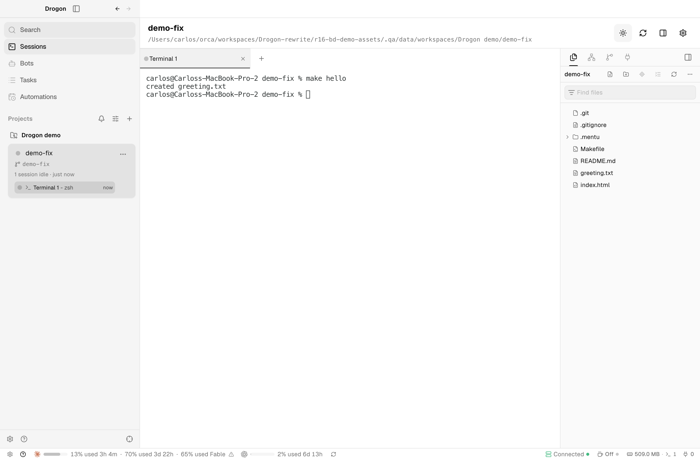
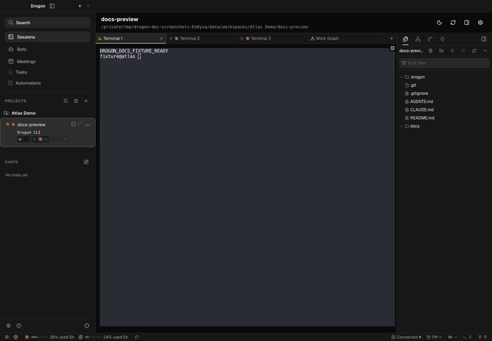
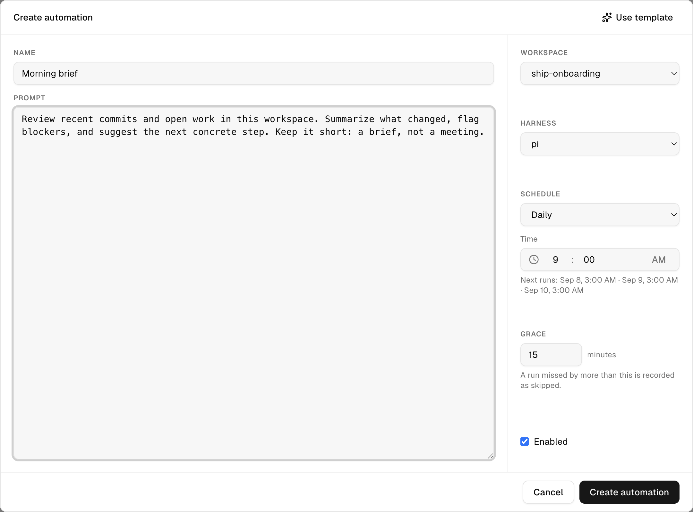

# Drogon

### Less meeting. More shipping.

**An open-source desktop workspace for developers who hate meetings and love building.**

Drogon is a from-zero rewrite of the [Orca](https://github.com/LovecastAI) desktop
experience: a **Rust core** with a `drogond` daemon and a `drogon-cli` client, plus an
**Electron/React desktop** on top. Coding agents, Git worktrees, persistent terminals,
code review, and repeatable workflows live in one place. Give each task its own
workspace, keep long-running sessions close to the code, and review what changed
without piecing together a dozen windows.

Drogon is MIT-licensed. The desktop UI is ported component-by-component from the Orca
source (MIT, © Lovecast Inc. — see [THIRD_PARTY_NOTICES.md](THIRD_PARTY_NOTICES.md)),
and the Bots, Automations, and Mentu-recipe concepts come from the Drogon fork of
Orca. This repository does not depend on Orca's runtime to execute anything.

[Run locally](#run-locally) · [Install with Homebrew](#install-with-homebrew) · [Install the macOS preview](#install-the-macos-preview) · [Feature tour](#feature-tour-the-twelve-mvp-journeys) · [Use it with agents](#using-drogon-with-agents) · [Contribute](#contributing)



_A real Drogon session running a demo project and shell session. No AI inference is running in this capture._



> **Early preview, under active development.** The current packaging and installation flow targets macOS. Expect rough edges; use a dedicated development data directory, not production data.

## Built for flow, not status updates

Your next step should be visible in the workspace—not buried in a meeting recap.

- **Give every task room to build.** Organize repositories and folders into projects. Create Git worktrees for parallel changes without switching branches underneath another session.
- **Keep agents and terminals together.** Work with Claude Code, Pi, or OpenCode in terminal tabs. Daemon-owned sessions survive renderer restarts, with agent activity and input notifications surfaced in the desktop.
- **Review where the work happens.** Browse and edit files, inspect diffs, stage changes, commit, push, and create pull requests through GitHub CLI.
- **Move from issue to workspace.** Browse GitHub Issues in Tasks and start a worktree and session from an issue.
- **Preview without leaving the task.** Open the embedded browser alongside your work. Agents can navigate, inspect, click, and fill through `drogon-cli` while the desktop is connected.
- **Make recurring work explicit.** Schedule automations, give bots responsibilities, and inspect their run history. Use Mentu recipes for approval-driven workflows with execution evidence and retry controls.

## Feature tour: the twelve MVP journeys

The MVP scope ([docs/migration/rewrite-mvp-plan.md](docs/migration/rewrite-mvp-plan.md), section 2)
is organized as twelve journeys. Each one is implemented end to end, with automated
acceptance and a source-anchored fidelity oracle comparing the render against the
Orca reference.

1. **Backbone.** Add a repository or folder as a project, create a Git worktree, open a tab with a coding harness (Claude Code, Pi, OpenCode) or a plain shell, and watch agent state (working, idle, waiting for input) in the sidebar and tab strip. Native notifications fire when an agent asks for input. Sessions persist across renderer and daemon restarts.
2. **Review.** Files and a Monaco editor, a diff viewer, and a Source Control panel with diff, stage, commit, push, and pull-request creation through `gh`.
3. **`drogon-cli`.** Orchestration (run, task, dispatch, ask, check, reply) plus `terminal create/send/read/wait`, `worktree create/list/rm`, `project add/list/remove`, and `browser open/snapshot/click/fill`. Every terminal ships a version-matched `drogon-cli` shim and a `drogon-cli skills get` guide for agents.
4. **Browser.** An embedded browser pane with address bar, navigation, find, zoom, and tab integration — controllable from `drogon-cli` through the daemon's desktop relay so agents can browse on your behalf.
5. **Palette and search.** `⌘K` command palette, `⌘P` quick open with file search in the daemon, and `⌘J` jump palette for workspaces, sessions, and browser tabs.
6. **Tasks.** A page fed by GitHub Issues via `gh`: list, filter, paginate, a pull-request mode with review/checks/merge cells, and “start” creates a worktree and session from an issue or PR.
7. **Automations.** A cron scheduler runs inside the daemon on top of the automation runner, with an editor, local-time schedules, a Runs dashboard, run detail, and history — including runs by a real coding agent.
8. **Bots.** Create bots with presets, assign responsibilities (cron-backed), chat over visible `bot.run` execution, and browse per-bot history.
9. **Mentu.** Choose a recipe, approve it by hash, execute it with the pinned Mentu runtime (provisioned at install, revision-locked), then inspect per-step evidence, metrics, cancel, and retry. Recipes are editable with daemon-side validation.
10. **Settings.** Theme (system/light/dark), default harness, rebindable shortcuts, notifications, and Git/GitHub auth panes — all persisted and taking effect immediately, including “Restart daemon”.
11. **Packaging.** An ad-hoc-signed, sealed `Drogon.app` with verified build info, packaged acceptance against a disposable profile, and a per-user installer that preserves previous builds.
12. **Status bar.** The Orca bottom bar: settings and help on the left, per-provider usage meters with refresh, and on the right awake on/off, memory, terminal and port counts, and the daemon connection segment.

## A brief, not another meeting

Turn a recurring prompt into a scheduled workspace task: a morning summary, a maintenance sweep, or a weekly review. Choose the workspace, harness, and schedule; keep the resulting work traceable through run history.



_An example automation draft in the real preview UI. It was not saved or executed._

## From task to pull request

1. **Add a project.** Open a repository or folder, then create a workspace for the task.
2. **Start a session.** Use your preferred installed coding harness or a plain shell.
3. **Build and inspect.** Keep files, terminal output, browser previews, and changes within reach.
4. **Review and ship.** Stage the intended changes, commit, and open a pull request.
5. **Repeat what works.** Turn recurring work into an automation or an approved Mentu recipe.

The goal is fewer “can we sync?” messages and more concrete changes to review.

## Architecture

Drogon is split so the desktop is a view, not the lifetime of your work.

```
┌────────────────────────────┐         ┌───────────────────────────────┐
│ Electron/React desktop     │  local  │ drogond (Rust daemon)         │
│ (apps/desktop)             │◄───────►│  • protocol v1 over a Unix    │
│  • app shell, sidebar,     │  socket │    socket / Windows named pipe│
│    tabs, editor, browser   │         │  • PTY sessions (live /       │
│  • xterm.js terminals      │         │    unverifiable / exited)     │
│  • bridges: files, git,    │         │  • projects, worktrees, files │
│    browser, bots, tasks,   │         │  • harness launches + hooks   │
│    automations, mentu      │         │  • cron scheduler + runner    │
└───────────┬────────────────┘         │  • bots, Mentu runtime lock   │
            │ `drogon-cli`             │  • orchestration (tasks,      │
┌───────────▼────────────────┐         │    dispatch, ask/reply)       │
│ drogon-cli (Rust)          │────────►└───────────────────────────────┘
│ shell shim in every        │
│ Drogon terminal            │
└────────────────────────────┘
```

- **`crates/drogon-core`** — domain state: sessions/PTYs, workspaces, worktrees, files, git, bots, automations, Mentu, orchestration records.
- **`crates/drogon-protocol`** — the versioned wire protocol; daemon and CLI negotiate it on connect.
- **`crates/drogond`** — the daemon: owns runtime state, listens on a local Unix socket (Windows named pipe in progress), and survives desktop restarts.
- **`crates/drogon-harness`** — discovery and launch of Claude Code, Pi, OpenCode, and plain shells, with state hooks that report `working` / `needs_input` from each harness.
- **`crates/drogon-cli`** — the client, also the agent's interface inside sessions.
- **`crates/drogon-orchestration`** — native multi-agent coordination: runs, tasks, dispatches, blocking ask/reply, worker lifecycle.
- **`apps/desktop`** — the Electron/React UI. The renderer talks to the daemon through preload bridges; terminals render with xterm.js over WebGL.

Two rules fall out of this shape. First, **liveness is a verdict, not a guess**: sessions report `live`, `unverifiable`, or `exited`, and losing contact never proves exit. Second, **no telemetry and no updater** in the preview: the only network use is yours (git, `gh`, harnesses, and the pages you open).

**No real model inference runs inside the app's own test and acceptance paths** — they use shell fixtures. Coding harnesses and their provider accounts are configured separately; their network use and data policies still apply. GitHub features require `gh` and appropriate authentication. Mentu execution requires its pinned runtime.

## Using Drogon with agents

Every Drogon terminal starts with a version-matched `drogon-cli` shim on `PATH` and a
`DROGON_*` session environment, so agents can drive the workspace they are running in:

```sh
drogon-cli agent-context            # machine-readable command schema
drogon-cli skills get drogon-cli    # the version-matched guide, like `orca skills get`
drogon-cli terminal list            # sessions of this workspace
drogon-cli worktree list --project <ID>
drogon-cli browser open https://example.com
drogon-cli browser snapshot         # accessibility tree of the embedded browser
```

The orchestration verbs (`run`, `task`, `dispatch`, `ask`, `check`, `reply`) mirror
Orca's, so a worker agent can coordinate with a human supervisor without leaving the
terminal. From a shell you get the same client:

```sh
export DROGON_DATA_DIR=/tmp/drogon-dev
./target/debug/drogon-cli status
./target/debug/drogon-cli project list
```

## Run locally

### Requirements

- Rust **1.98**
- Node.js **24**
- pnpm **11.19.0** (declared in `packageManager`)
- Git; GitHub CLI (`gh`) for GitHub features
- A supported coding harness installed and configured if you want agent sessions

```sh
git clone https://github.com/clioo/drogon.git
cd drogon
pnpm install --frozen-lockfile
cargo build --workspace --locked
```

Start the daemon with an isolated data directory:

```sh
./target/debug/drogond --data-dir /tmp/drogon-dev
```

In another terminal, start the desktop with the **same** data directory:

```sh
DROGON_DATA_DIR=/tmp/drogon-dev pnpm --filter @drogon/desktop dev
```

For a built desktop instead of the development server:

```sh
pnpm --filter @drogon/desktop build
DROGON_DATA_DIR=/tmp/drogon-dev pnpm --filter @drogon/desktop start
```

### Development gates

The acceptance gates every change must pass (see [AGENTS.md](AGENTS.md)):

```sh
cargo fmt --all -- --check
cargo clippy --workspace --all-targets -- -D warnings
cargo test --workspace --locked
pnpm typecheck
pnpm --filter @drogon/desktop test
pnpm test:renderer-contracts
pnpm test:packaging
pnpm --filter @drogon/desktop build     # production bundle catches CSS/bundler errors
node scripts/accept-desktop.mjs --files # rendered acceptance over CDP (expects PASSED)
```

The **fidelity oracle** (`scripts/fidelity/compare-surfaces.mjs`) renders the app and
diffs named UI surfaces against the Orca reference, both pixel- and
accessibility-tree-level; every reported difference becomes a tracked fix. Rendered
checks run through Playwright over CDP with `DROGON_BACKGROUND_WINDOW=1` so test
windows stay inactive and never steal focus.

## Install the macOS preview

From a clean checkout on `main`, build the release binaries and an ad-hoc-signed,
sealed `Drogon.app` (this is also `pnpm package:desktop`):

```sh
node scripts/package-desktop.mjs
```

Validate the packaged app against a disposable profile — the acceptance run prints
the report path and must end in PASSED:

```sh
node scripts/accept-desktop.mjs --bundle <path-to-Drogon.app> --files
```

Install it using the resulting acceptance report (this is also `pnpm install:preview`):

```sh
node scripts/install-preview.mjs --bundle <path-to-Drogon.app> --report <path-to-acceptance-report>
```

The installer links `~/Applications/Drogon.app` to an immutable, verified build under
`~/Applications/.drogon-builds/`, preserves earlier builds, and does not stop a running
daemon. The installed preview uses `~/Library/Application Support/Drogon` for its data.

### Install with Homebrew

The public cask installs the arm64 desktop, its bundled daemon, and `drogon-cli`:

```sh
brew tap clioo/drogon
brew install --cask --no-quarantine clioo/drogon/drogon
DROGON_DATA_DIR=/tmp/drogon-dev drogon-cli --version
```

Drogon currently publishes Apple Silicon releases only (Intel is not built). The
cask declares macOS Sonoma or newer: Electron 44 itself requires macOS Ventura
(13) or newer, but Sonoma is the supported release floor for this arm64 cask.
Homebrew stops the detached Drogon daemon before uninstall and upgrade; to recover
a Homebrew-managed data directory after a downgrade refusal, use
`brew reinstall --cask clioo/drogon/drogon` or install the previous cask version.

> **Gatekeeper:** release bundles are currently ad-hoc signed, not notarized. Use
> `--no-quarantine` as shown above (or macOS may report the app as damaged). The
> cask caveat will be updated when Developer ID notarization is configured.

> **Gatekeeper:** the preview is ad-hoc signed, not notarized. On first launch,
> right-click `Drogon.app` and choose **Open** (or allow it in
> System Settings → Privacy & Security) to bypass the default quarantine warning.

## Contributing

Bug reports, focused pull requests, and reproducible workflow feedback are welcome. For UI issues, include a screenshot and the steps that led to it; never include credentials or raw provider transcripts.

Read [AGENTS.md](AGENTS.md) and the [current MVP scope and implementation status](docs/migration/rewrite-mvp-plan.md) before making changes. The [changelog](CHANGELOG.md) lists every merged PR by area.

## License and credits

[MIT](LICENSE) © Carlos (clioo).

- **Orca / Lovecast Inc.** — the desktop experience Drogon rewrites; ported UI components keep their `MIT Copyright (c) 2026 Lovecast Inc.` notices in the source. See [THIRD_PARTY_NOTICES.md](THIRD_PARTY_NOTICES.md) for the full attribution and dependency licensing.
- **The Drogon fork of Orca** — the source of the Bots, Automations, and Mentu recipes-and-evidence concepts ported here.
- Drogon is an independent rewrite, not affiliated with or endorsed by Orca or Lovecast Inc.
