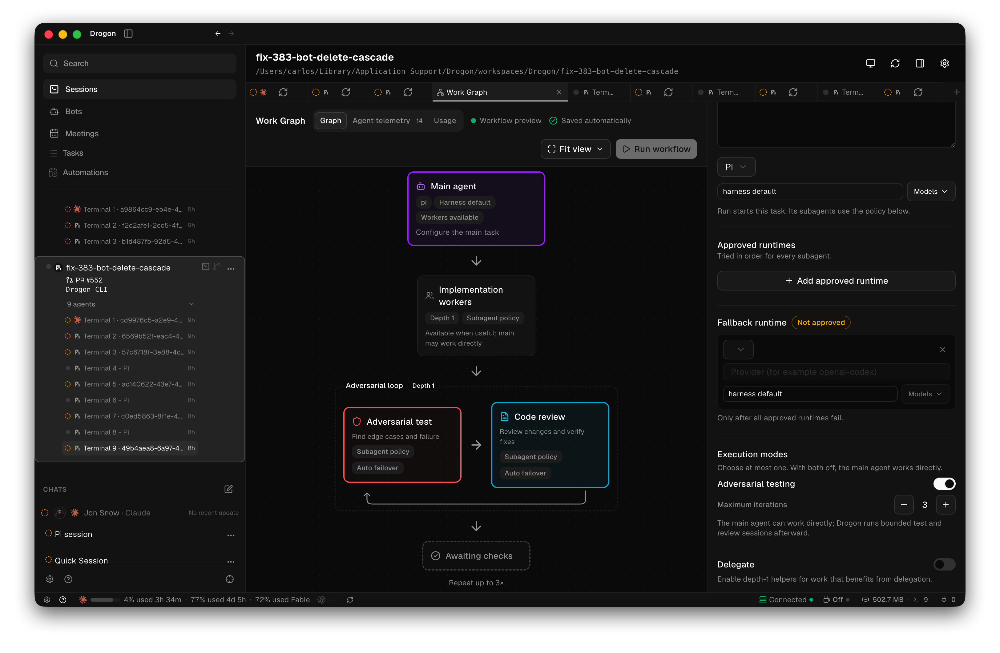
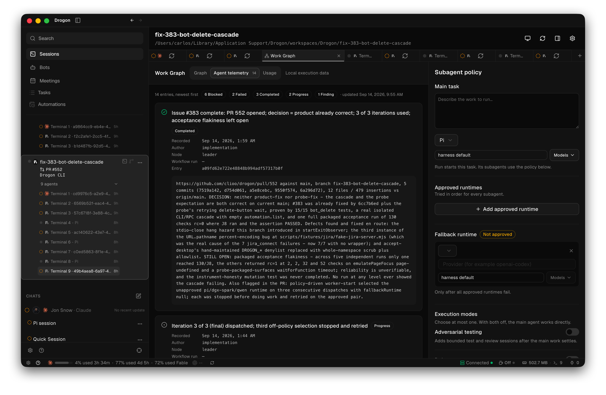
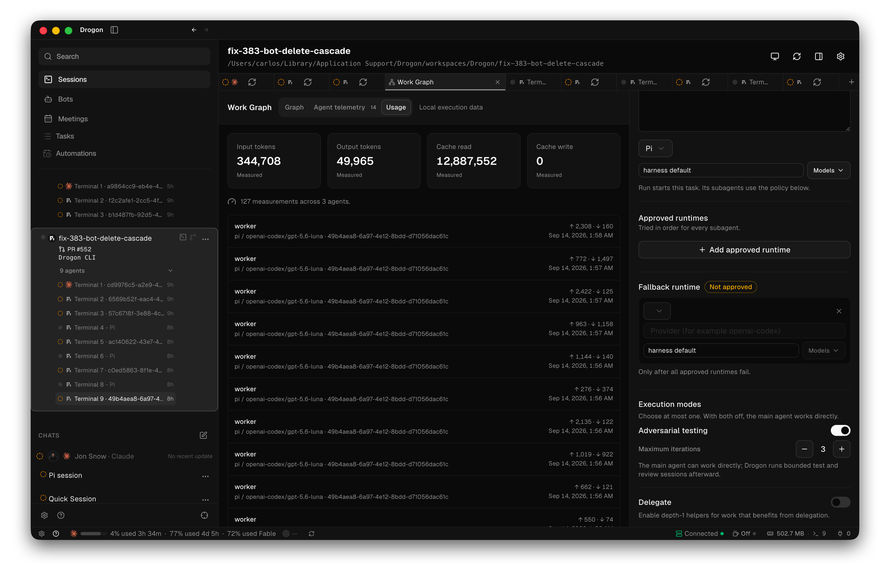

# Drogon

### Put every subscription to work.

**The open-source agentic development environment for your most ambitious builds.**

### [Explore drogon.work](https://drogon.work) · [Download for Mac](https://github.com/clioo/drogon/releases/tag/v0.1.0-rc.7) · [Watch the demo](https://youtu.be/jgnitCkmpKk)

**Available for macOS: Apple Developer ID signed and notarized by Apple.**
The downloadable [v0.1.0-rc.7 release candidate](https://github.com/clioo/drogon/releases/tag/v0.1.0-rc.7)
targets Apple Silicon and macOS Sonoma (14) or newer. Install through
[Homebrew](#install-with-homebrew) or download the app directly; no source build is required.

Coordinate coding agents across the vendors you already pay for. Keep your preferred
harness, delegate work to other configured harnesses, and run independent tasks in
parallel worktrees. Use the Work Graph to coordinate implementation, adversarial
testing, and review, with runtime attempts and verdicts you can inspect before shipping.
Bots watch for work and start sessions in the right project.

Drogon runs locally: a **Rust core**, the `drogond` daemon, and `drogon-cli`, with an
**Electron/React desktop**. Model access stays with each harness and its configured
subscription or provider account. You set the goal, execution policy, and final approval.

Drogon is MIT-licensed. Its desktop UI began as a component-by-component port of the
[Orca](https://github.com/LovecastAI) source (MIT, © Lovecast Inc. — see
[THIRD_PARTY_NOTICES.md](THIRD_PARTY_NOTICES.md)), and the Bots and Automations concepts
came from the Drogon fork of Orca. It has since grown its own surfaces — the Work Graph
and its Orchestrator, self-waking Bots, Meetings — and depends on no other runtime to
execute anything.

[Install with Homebrew](#install-with-homebrew) · [Build from source](#run-locally) · [Feature tour](#feature-tour) · [Use it with agents](#using-drogon-with-agents) · [Engineering evidence](#hackathon-engineering-evidence) · [Contribute](#contributing)

## See the workflow you are running

Give the main agent a task, choose the harnesses its workers can use, and configure
the verification loop. Keep the graph and the individual agent sessions in one workspace.



_The workflow preview in the developer's Drogon workspace: depth-1 workers and an
adversarial loop capped at three iterations. This view shows the configured structure;
execution outcomes appear in Agent telemetry._

## Follow how your agents work together

See dispatches, findings, progress, and decisions as agents report back. Open the
recorded detail to understand what was attempted, what changed, and what still needs attention.



_An actual development session for [PR #552](https://github.com/clioo/drogon/pull/552).
The record includes completed work, failures, and blocked attempts, including the
agent's report of remaining acceptance flakiness._

## See where your tokens go

Track reported input, output, cache-read, and cache-write tokens. Inspect measurements
by agent and runtime to understand how work is distributed across your configured providers.
Missing usage stays unavailable rather than being counted as zero; token counts are
not a claim about subscription savings or a provider's final bill.



_127 recorded measurements across three agents in this workspace. These are the
values visible in this capture, not a benchmark. All three images were supplied by
the developer from Drogon on September 14, 2026; [capture details](docs/screenshots/MANIFEST.md)._

## Coordinate the work from one place

From a monitored pull request to parallel implementation and verification, keep the
task, its context, and its outcome within reach.

- **Give every task room to build.** Organize repositories and folders into projects. Create Git worktrees for parallel changes without switching branches underneath another session.
- **Keep agents and terminals together.** Work with Claude Code, Pi, or OpenCode in terminal tabs. Daemon-owned sessions survive renderer restarts, with agent activity and input notifications surfaced in the desktop.
- **Review where the work happens.** Browse and edit files, inspect diffs, stage changes, commit, push, and create pull requests through GitHub CLI.
- **Move from issue to workspace.** Browse GitHub Issues in Tasks and start a worktree and session from an issue.
- **Preview without leaving the task.** Open the embedded browser alongside your work. Agents can navigate, inspect, click, and fill through `drogon-cli` while the desktop is connected.
- **Make recurring work explicit.** Schedule automations, give bots responsibilities and the monitors that wake them, and inspect every run. Design the work itself in the Work Graph: nodes with their own harness and model, an approved-runtime order to fall back through, and an optional bounded adversarial review before anything is called done.

## Feature tour

Drogon grew as twelve end-to-end journeys. Each one ships with automated acceptance;
the packaged build is validated as a whole before every release.

1. **Backbone.** Add a repository or folder as a project, create a Git worktree, open a tab with a coding harness (Claude Code, Pi, OpenCode) or a plain shell, and watch agent state (working, idle, waiting for input) in the sidebar and tab strip. Native notifications fire when an agent asks for input. Sessions persist across renderer and daemon restarts.
2. **Review.** Files and a Monaco editor, a diff viewer, and a Source Control panel with diff, stage, commit, push, and pull-request creation through `gh`.
3. **`drogon-cli`.** Orchestration (run, task, dispatch, ask, check, reply) plus `terminal create/send/read/wait`, `worktree create/list/rm`, `project add/list/remove`, and `browser open/snapshot/click/fill`. Every terminal ships a version-matched `drogon-cli` shim and a `drogon-cli skills get` guide for agents.
4. **Browser.** An embedded browser pane with address bar, navigation, find, zoom, and tab integration — controllable from `drogon-cli` through the daemon's desktop relay so agents can browse on your behalf.
5. **Palette and search.** `⌘K` command palette, `⌘P` quick open with file search in the daemon, and `⌘J` jump palette for workspaces, sessions, and browser tabs.
6. **Tasks.** A page fed by GitHub Issues via `gh`: list, filter, paginate, a pull-request mode with review/checks/merge cells, and “start” creates a worktree and session from an issue or PR.
7. **Automations.** A cron scheduler runs inside the daemon on top of the automation runner, with an editor, local-time schedules, a Runs dashboard, run detail, and history — including runs by a real coding agent.
8. **Bots.** Create bots with presets and give them responsibilities (cron-backed), chat over visible `bot.run` execution, and browse per-bot history. A bot owns its own **monitors** — a file digest, an HTTP poll, a script, or a `github_pr.v1` watch on a repository — and a monitor that fires can release real work: a watched pull request opens a worktree and starts a review session, with the firing evidence recorded and deduplicated by case.
9. **Work Graph.** The Orchestrator launches its **Main agent** and every optional role as a native, visible workspace session. **Delegate** allows depth-1 workers when parallel or specialized work benefits from them without forbidding the main agent from working directly. **Adversarial testing** adds a bounded *Adversarial test* and *Code review* loop after the main work settles. The **Subagent policy** chooses approved runtimes in order and an explicit fallback used only after they fail. `.drogon/graph.json` keeps a strict split: `intent` is yours, `state` is what the daemon observed, and every runtime attempt and verdict appears on the node and in *Evidence*.
10. **Settings.** Theme (system/light/dark), default harness, rebindable shortcuts, notifications, Git/GitHub auth panes, and an optional Mentu runtime installer on Apple silicon macOS — all persisted and taking effect immediately, including “Restart daemon”.
11. **Mac distribution.** A downloadable `Drogon.app`, signed with Apple Developer ID and notarized by Apple, with a Homebrew cask, verified build identity, and published release checks. Local source builds use ad-hoc signing unless a Developer ID is configured.
12. **Status bar.** The Orca bottom bar: settings and help on the left, per-provider usage meters with refresh, and on the right awake on/off, memory, terminal and port counts, and the daemon connection segment.

## From a task to a repeatable workflow

The twelve journeys were the scope. Three things grew out of using them.

**Meetings became a section, not a sidebar.** Drogon indexes the Markdown transcripts
written by a local note-taking tool — read-only, never edited or moved — and makes a
corpus of hundreds usable: full-text search, date and duration filters, bounded reads
instead of loading everything. From a transcript you can pull out commitments and turn
one into a real Drogon task, with the line it came from shown next to it. Extraction is
a suggestion until you accept it, and it runs on a free local model, so browsing your
own meetings never costs anything.

**Bots grew their own triggers.** A bot no longer waits to be asked. It owns monitors —
a file digest, an HTTP poll, a script, or a watch on a repository's pull requests — and
a monitor that fires releases real work rather than just a notification: a watched pull
request opens a worktree and starts a review session in it. New watches park until you
approve them, and every firing records what it saw.

**The Work Graph replaced writing recipes by hand.** The Orchestrator records which
runtimes native agent sessions may use, what to fall back to when they fail, and one
optional execution mode: a bounded adversarial pass after the main work, or permission
to use depth-1 helpers when delegation is genuinely useful. Neither mode blocks the main
agent from answering simple questions, running normal repository commands, or making
changes the user requests. The configured policy reaches the next session's brief, so a
toggle in the UI changes how the agent actually behaves.

## A brief, not another meeting

Turn a recurring prompt into a scheduled workspace task: a morning summary, a maintenance sweep, or a weekly review. Choose the workspace, harness, and schedule; keep the resulting work traceable through run history.

## From task to pull request

1. **Add a project.** Open a repository or folder, then create a workspace for the task.
2. **Start a session.** Use your preferred installed coding harness or a plain shell.
3. **Build and inspect.** Keep files, terminal output, browser previews, and changes within reach.
4. **Review and ship.** Stage the intended changes, commit, and open a pull request.
5. **Repeat what works.** Turn recurring work into an automation, a bot's monitor, or a node in the Work Graph.

The goal is fewer “can we sync?” messages and more concrete changes to review.

## Architecture

Drogon is split so the desktop is a view, not the lifetime of your work.

```
┌────────────────────────────┐         ┌───────────────────────────────┐
│ Electron/React desktop     │  local  │ drogond (Rust daemon)         │
│ (apps/desktop)             │◄───────►│  • protocol v1 over a Unix    │
│  • app shell, sidebar,     │  socket │    socket / Windows named pipe│
│    tabs, editor, browser   │         │  • PTY sessions (live /       │
│  • xterm.js terminals      │         │    unverifiable / exited)     │
│  • bridges: files, git,    │         │  • projects, worktrees, files │
│    browser, bots, tasks,   │         │  • harness launches + hooks   │
│    automations, graph,     │         │  • cron scheduler + runner    │
│    meetings                │         │  • work graph + failover      │
└───────────┬────────────────┘         │  • bots, monitors, backups    │
            │ `drogon-cli`             │  • orchestration (tasks,      │
┌───────────▼────────────────┐         │    dispatch, ask/reply)       │
│ drogon-cli (Rust)          │────────►└───────────────────────────────┘
│ shell shim in every        │
│ Drogon terminal            │
└────────────────────────────┘
```

- **`crates/drogon-core`** — domain state: sessions/PTYs, workspaces, worktrees, files, git, bots and their monitors, automations, the work graph and its failover episodes, meetings, orchestration records. The native orchestrator launches every graph role through Drogon sessions; the separately installed Mentu runtime is only for optional recipe commands.
- **`crates/drogon-protocol`** — the versioned wire protocol; daemon and CLI negotiate it on connect.
- **`crates/drogond`** — the daemon: owns runtime state, listens on a local Unix socket (Windows named pipe in progress), and survives desktop restarts.
- **`crates/drogon-harness`** — discovery and launch of Claude Code, Pi, OpenCode, and plain shells, with state hooks that report `working` / `needs_input` from each harness.
- **`crates/drogon-cli`** — the client, also the agent's interface inside sessions.
- **`crates/drogon-orchestration`** — native multi-agent coordination: runs, tasks, dispatches, blocking ask/reply, worker lifecycle.
- **`apps/desktop`** — the Electron/React UI. The renderer talks to the daemon through preload bridges; terminals render with xterm.js over WebGL.

Two rules fall out of this shape. First, **liveness is a verdict, not a guess**: sessions report `live`, `unverifiable`, or `exited`, and losing contact never proves exit. Second, **execution evidence stays local**: Agent telemetry and Usage are workspace records, not analytics sent to Drogon. There is no automatic updater in the preview; git, `gh`, harnesses, and pages you open use the network through your configured tools.

**No real model inference runs inside the app's own test and acceptance paths** — they use shell fixtures. Coding harnesses and their provider accounts are configured separately; their network use and data policies still apply. GitHub features require `gh` and appropriate authentication. Mentu is not downloaded during packaging or startup; Mentu execution requires its optional pinned runtime, which Apple silicon macOS users can install explicitly in Settings.

## Using Drogon with agents

Every Drogon terminal starts with a version-matched `drogon-cli` shim on `PATH` and a
`DROGON_*` session environment, so agents can drive the workspace they are running in:

```sh
drogon-cli agent-context            # machine-readable command schema
drogon-cli skills get drogon-cli    # the version-matched guide, like `orca skills get`
drogon-cli terminal list            # sessions of this workspace
drogon-cli worktree list --project <ID>
drogon-cli browser open https://example.com
drogon-cli browser snapshot         # accessibility tree of the embedded browser
```

An agent can also read the design it is working inside, and act on the policy it finds:

```sh
drogon-cli graph read --workspace <ID>        # intent (yours) + state (observed)
drogon-cli graph write-intent --workspace <ID> --file graph.json
drogon-cli graph run --workspace <ID> --all   # compile and run the whole graph
drogon-cli graph run-node-failover --workspace <ID> --node <ID> --follow
drogon-cli bot watch-pr --repo <owner/name>   # a watch that releases a review session
drogon-cli meeting list --limit 20            # the indexed transcripts, read-only
drogon-cli backups list                       # pre-migration snapshots, restorable
```

When a workspace has a configured subagent policy, Drogon writes it into a managed block
in that workspace's `AGENTS.md` and `CLAUDE.md` at session start, so the agent knows
whether it should delegate or do the work itself. A workspace with no policy is left
untouched — Drogon never creates those files on its own.

The orchestration verbs (`run`, `task`, `dispatch`, `ask`, `check`, `reply`) mirror
Orca's, so a worker agent can coordinate with a human supervisor without leaving the
terminal. From a shell you get the same client:

```sh
export DROGON_DATA_DIR=/tmp/drogon-dev
./target/debug/drogon-cli status
./target/debug/drogon-cli project list
```

## Run locally

### Requirements

- Rust **1.98** — via [rustup](https://rustup.rs): `rustup toolchain install 1.98`
- Node.js **24** (supported range `>=24 <27`, from `engines`): [nodejs.org](https://nodejs.org) or `brew install node@24`
- pnpm **11.19.0** (declared in `packageManager`) — not on `PATH` by default: `npm install -g pnpm@11.19.0`
- Git; GitHub CLI (`gh`) for GitHub features
- A supported coding harness installed and configured if you want agent sessions

```sh
git clone https://github.com/clioo/drogon.git
cd drogon
node scripts/check-toolchains.mjs   # fail fast with "you need X" when a floor is missed
pnpm install --frozen-lockfile
cargo build --workspace --locked
```

On a current Apple Silicon Mac the first build takes well under a minute with
empty caches (`cargo build` measured 34–53s across runs; `pnpm install` and
`pnpm typecheck` are seconds each). A clean-room rerun of exactly these commands lives in
`node scripts/e2e-fresh-clone.mjs --full`; the fast static probes
(`--check`) run in CI.

Start the daemon with an isolated data directory:

```sh
./target/debug/drogond --data-dir /tmp/drogon-dev
```

In another terminal, start the desktop with the **same** data directory:

```sh
DROGON_DATA_DIR=/tmp/drogon-dev pnpm --filter @drogon/desktop dev
```

For a built desktop instead of the development server:

```sh
pnpm --filter @drogon/desktop build
DROGON_DATA_DIR=/tmp/drogon-dev pnpm --filter @drogon/desktop start
```

### Development gates

The acceptance gates every change must pass (see [AGENTS.md](AGENTS.md)):

```sh
cargo fmt --all -- --check
cargo clippy --workspace --all-targets -- -D warnings
cargo test --workspace --locked
pnpm typecheck
pnpm --filter @drogon/desktop test
pnpm test:renderer-contracts
pnpm test:packaging
pnpm --filter @drogon/desktop build     # production bundle catches CSS/bundler errors
node scripts/accept-desktop.mjs --files # rendered acceptance over CDP (expects PASSED)
```

Rendered checks run through Playwright over CDP with `DROGON_BACKGROUND_WINDOW=1` so
test windows stay inactive and never steal focus. Surfaces are compared against their
own recorded baselines, pixel- and accessibility-tree-level; every reported difference
becomes a tracked fix.

A hermetic Linux pass of the portable gates — no Mac state involved — runs from
a clean `node:24` container with Rust 1.98:

```sh
./docs/hermetic-linux/run-check.sh
```

A green container is not a validated desktop: it cannot cover the `.app`,
Electron rendering, packaging, or Gatekeeper. Those need macOS (the acceptance
line above, ending in PASSED).

## Hackathon engineering evidence

The submission separates the product specification from the process used to build it:
[SPEC.md](docs/SPEC.md) links requirements to implementation and tests;
[SYSTEM.md](docs/SYSTEM.md) explains context, specialist workers, parallel worktrees,
QA and human decisions; [AI-DEV-LOG.md](docs/AI-DEV-LOG.md) traces failures through
corrective commits and re-verification.

The development gates above supplied machine-readable feedback to the agents.
Independent reviews and rendered Electron QA supplied failures those checks missed.
The coordinator returned that evidence to implementation workers, who corrected the
behavior and added regressions before re-verification. PR #5 is a dated example in
the log: review finding, subsequent correction, committed failing-test output and
green CI on the corrected SHA. Ordinary acceptance uses fixtures; historical
live-model exploratory runs are labeled separately. The spec links the original
pre-implementation goal rather than presenting this retrospective documentation as
the original plan.

## Install it in one command

`make install` packages this checkout, replaces the installed app, and brings
both halves back up — the daemon it ships and the desktop:

```sh
make install                 # build, replace /Applications/Drogon.app, restart
make install-main            # the same, from a fresh origin/main build
make install BUNDLE=<path>   # install an already-packaged Drogon.app
make install FLAGS=--no-restart
```

It runs the toolchain preflight (`node scripts/check-toolchains.mjs`) before
building, then quits the running app, stops its detached daemon through that
bundle's own scoped `drogon-stop-daemon`, swaps the bundle with two renames
(keeping the previous build beside it for rollback), relaunches, and then
reports whether the new service actually came back. Packaging refuses a dirty
checkout, so commit first. The lower-level flow below stays available and is
what a release uses.

`make install` always targets `/Applications/Drogon.app` — it quits the
running app and replaces the bundle, so there is no isolated-prefix mode.
Hands-off installs go through the preview flow or Homebrew below.

## Install the macOS preview

From a clean checkout on `main`, build the release binaries and an ad-hoc-signed,
sealed `Drogon.app` (this is also `pnpm package:desktop`):

```sh
node scripts/package-desktop.mjs
```

Validate the packaged app against a disposable profile — the acceptance run prints
the report path and must end in PASSED:

```sh
node scripts/accept-desktop.mjs --bundle <path-to-Drogon.app> --files
```

Install it using the resulting acceptance report (this is also `pnpm install:preview`):

```sh
node scripts/install-preview.mjs --bundle <path-to-Drogon.app> --report <path-to-acceptance-report>
```

The installer links `~/Applications/Drogon.app` to an immutable, verified build under
`~/Applications/.drogon-builds/`, preserves earlier builds, and does not stop a running
daemon. The installed preview uses `~/Library/Application Support/Drogon` for its data.

### Install with Homebrew

The public cask installs the arm64 desktop, its bundled daemon, and `drogon-cli`:

```sh
brew trust --tap clioo/drogon
brew tap clioo/drogon
brew install --cask clioo/drogon/drogon
DROGON_DATA_DIR=/tmp/drogon-dev drogon-cli --version
```

Trust first, then tap: Homebrew refuses third-party casks from untrusted taps,
and it validates every cask *while tapping*, so `brew tap` on an untrusted tap
fails outright with one `Refusing to load cask ...` line per platform and a final
`Cannot tap clioo/drogon: invalid syntax in tap!`. That message names a syntax
error the cask does not have; the tap is simply untrusted. If you already hit it,
run the trust command and tap again — nothing is broken. Trust is stored per user
in `~/.homebrew/trust.json` (or `$XDG_CONFIG_HOME/homebrew/trust.json`), so it
never repeats. Trust the *tap*, not just the cask: a trusted cask inside an
untrusted tap still fails at tap time.

To move an older cask forward:

```sh
brew update
brew upgrade --cask clioo/drogon/drogon
brew info --cask clioo/drogon/drogon   # installed version vs tap version
drogon-cli --version                   # must match the installed cask
```

> **Ad-hoc builds and Gatekeeper.** On ad-hoc-signed casks (versions older
> than v0.1.0-rc.3), a fresh install stays quarantined until you approve it —
> open Drogon.app once (right-click → Open) or allow it in System Settings →
> Privacy & Security, as the cask caveats describe. Until the quarantine is
> cleared, `drogon-cli` stalls with no output at all and `brew uninstall`
> stalls instead of finishing: that is Gatekeeper holding the quarantined
> files, not a broken install. The clean-room audit
> (`scripts/e2e-brew-install.mjs`) asserts the install-to-launch flow for
> every cask that does not advertise ad-hoc.

Drogon currently publishes Apple Silicon releases only (Intel is not built). The
cask declares macOS Sonoma or newer: Electron 44 itself requires macOS Ventura
(13) or newer, but Sonoma is the supported release floor for this arm64 cask.
Homebrew stops the detached Drogon daemon before uninstall and upgrade; to recover
a Homebrew-managed data directory after a downgrade refusal, use
`brew reinstall --cask clioo/drogon/drogon` or install the previous cask version.

**Verified Mac distribution.** The published v0.1.0-rc.7 archive is Apple Developer ID
signed and notarized by Apple. Its [release pipeline](https://github.com/clioo/drogon/actions/runs/34861305249)
verified the signature, notarization ticket, and Gatekeeper acceptance after ZIP
extraction, then checked that the Homebrew cask serves the same archive.
Gatekeeper reported `Notarized Developer ID`. This is a release candidate distributed
directly and through Homebrew; local source builds have their own signing configuration.

The same pipeline executed 107 packaged acceptance checks and reported eight skipped
checks for unavailable real harnesses or a previous upgrade bundle. Those skips are
not passing results; the release log records the exact coverage and limitations.

## Contributing

Bug reports, focused pull requests, and reproducible workflow feedback are welcome. For UI issues, include a screenshot and the steps that led to it; never include credentials or raw provider transcripts.

Read [AGENTS.md](AGENTS.md) before making changes. The [changelog](CHANGELOG.md) lists every merged PR by area.

## License and credits

[MIT](LICENSE) © Carlos (clioo).

- **Orca / Lovecast Inc.** — the desktop experience Drogon's UI was originally ported from; those components keep their `MIT Copyright (c) 2026 Lovecast Inc.` notices in the source. See [THIRD_PARTY_NOTICES.md](THIRD_PARTY_NOTICES.md) for the full attribution and dependency licensing.
- **The Drogon fork of Orca** — the source of the Bots, Automations, and the recipes-and-evidence execution model ported here (the authoring surface has since become the Work Graph).
- Drogon is an independent project, not affiliated with or endorsed by Orca or Lovecast Inc.
