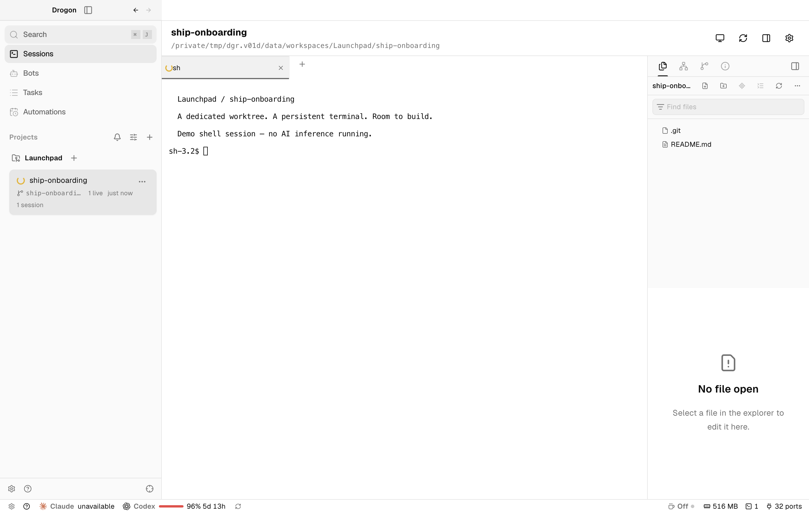

# Drogon

### Less meeting. More shipping.

**An open-source desktop workspace for developers who hate meetings and love building.**

Drogon brings coding agents, Git worktrees, terminals, code review, and repeatable workflows into one place. Give each task its own workspace, keep long-running sessions close to the code, and review what changed without piecing together a dozen windows.

Inspired by **Orca, Hermes, Mentu AI, and Opengraph**, Drogon aims to bring their best ideas into a developer-first workspace: parallel work, useful agents, explicit handoffs, and evidence you can inspect. These are inspirations—not a claim of bundled integrations or affiliation.

[Run locally](#run-locally) · [macOS preview](#install-the-macos-preview) · [Contribute](#contributing)



*A real Drogon preview running a demo project and shell session. No AI inference is running in this capture.*

> **Early preview, under active development.** The current packaging and installation flow targets macOS. Expect rough edges; use a dedicated development data directory, not production data.

## Built for flow, not status updates

Your next step should be visible in the workspace—not buried in a meeting recap.

- **Give every task room to build.** Organize repositories and folders into projects. Create Git worktrees for parallel changes without switching branches underneath another session.
- **Keep agents and terminals together.** Work with Claude Code, Pi, or OpenCode in terminal tabs. Daemon-owned sessions survive renderer restarts, with agent activity and input notifications surfaced in the desktop.
- **Review where the work happens.** Browse and edit files, inspect diffs, stage changes, commit, push, and create pull requests through GitHub CLI.
- **Move from issue to workspace.** Browse GitHub Issues in Tasks and start a worktree and session from an issue.
- **Preview without leaving the task.** Open the embedded browser alongside your work. Agents can navigate, inspect, click, and fill through `drogon-cli` while the desktop is connected.
- **Make recurring work explicit.** Schedule automations, give bots responsibilities, and inspect their run history. Use Mentu recipes for approval-driven workflows with execution evidence and retry controls.

## A brief, not another meeting

Turn a recurring prompt into a scheduled workspace task: a morning summary, a maintenance sweep, or a weekly review. Choose the workspace, harness, and schedule; keep the resulting work traceable through run history.


*An example automation draft in the real preview UI. It was not saved or executed. Screenshots show preview build `527d019819eb`; the interface continues to evolve.*

## From task to pull request

1. **Add a project.** Open a repository or folder, then create a workspace for the task.
2. **Start a session.** Use your preferred installed coding harness or a plain shell.
3. **Build and inspect.** Keep files, terminal output, browser previews, and changes within reach.
4. **Review and ship.** Stage the intended changes, commit, and open a pull request.
5. **Repeat what works.** Turn recurring work into an automation or an approved Mentu recipe.

The goal is fewer “can we sync?” messages and more concrete changes to review.

## Local runtime. Scriptable workspace.

Drogon has a **Rust core**, a **`drogond` daemon**, a **`drogon-cli` client**, and an **Electron/React desktop**. The daemon owns runtime state and terminal sessions; the desktop is not the lifetime of your work.

The CLI exposes projects, worktrees, terminals, browser control, automations, and native orchestration—including task dispatch and ask/reply flows. Agents can discover the version-matched interface rather than guess commands:

```sh
# After building; use the same data directory as your daemon.
export DROGON_DATA_DIR=/tmp/drogon-dev

./target/debug/drogon-cli status
./target/debug/drogon-cli project list
./target/debug/drogon-cli terminal --help
./target/debug/drogon-cli skills get drogon-cli
```

**No telemetry or updater in the preview.** Coding harnesses and their provider accounts are configured separately; their network use and data policies still apply. GitHub features require `gh` and appropriate authentication. Mentu execution requires its configured runtime.

## Run locally

### Requirements

- Rust **1.98**
- Node.js **24**
- pnpm **11.19.0** (declared in `packageManager`)
- Git; GitHub CLI (`gh`) for GitHub features
- A supported coding harness installed and configured if you want agent sessions

```sh
git clone https://github.com/clioo/drogon.git
cd drogon
pnpm install --frozen-lockfile
cargo build --workspace --locked
```

Start the daemon with an isolated data directory:

```sh
./target/debug/drogond --data-dir /tmp/drogon-dev
```

In another terminal, start the desktop with the **same** data directory:

```sh
DROGON_DATA_DIR=/tmp/drogon-dev pnpm --filter @drogon/desktop dev
```

For a built desktop instead of the development server:

```sh
pnpm --filter @drogon/desktop build
DROGON_DATA_DIR=/tmp/drogon-dev pnpm --filter @drogon/desktop start
```

## Install the macOS preview

From a clean checkout on `main`, build the release binaries and an ad-hoc-signed `Drogon.app`:

```sh
pnpm package:desktop
```

Use the generated bundle path to validate the packaged app against a disposable profile, then install it using the resulting acceptance report:

```sh
node scripts/accept-desktop.mjs --bundle <path-to-Drogon.app> --files
node scripts/install-preview.mjs --bundle <path-to-Drogon.app> --report <path-to-acceptance-report>
```

The installer links `~/Applications/Drogon.app` to an immutable build under `~/Applications/.drogon-builds/`, preserves earlier builds, and does not stop a running daemon. The installed preview uses `~/Library/Application Support/Drogon` for its data.

## Contributing

Bug reports, focused pull requests, and reproducible workflow feedback are welcome. For UI issues, include a screenshot and the steps that led to it; never include credentials or raw provider transcripts.

Read [AGENTS.md](AGENTS.md) and the [current MVP scope and implementation status](docs/migration/rewrite-mvp-plan.md) before making changes.

```sh
cargo fmt --check
cargo clippy --workspace --all-targets -- -D warnings
pnpm typecheck
pnpm test
pnpm test:renderer-contracts
pnpm accept:desktop
pnpm accept:core-cli
```

Acceptance scripts use isolated profiles and retain local evidence under `.preflight/acceptance`. Check their exit status and reports; one passing surface is not proof that every product or platform gate passed.

## License

[MIT](LICENSE). See [third-party notices](THIRD_PARTY_NOTICES.md) for attribution and dependency licensing.
